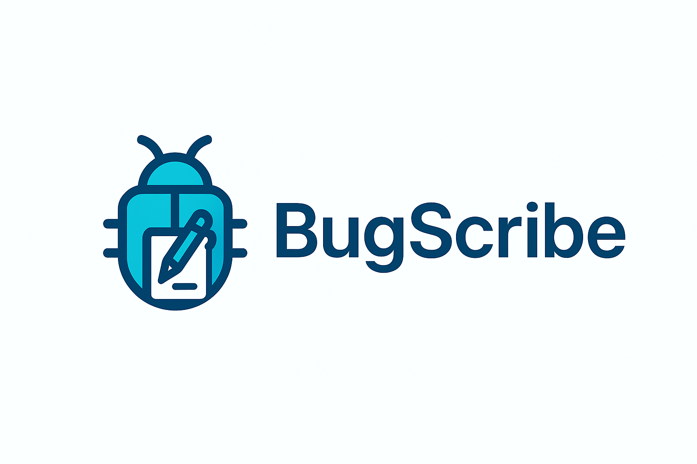

<h1 align="center">BugScribe</h1>

<p align="center">
    
</p></br>

BugScribe is a Node.js-based bug reporting and suggestion management system. It provides a simple backend for collecting, storing, and managing bug reports, suggestions, and related data for your applications or services.

## Features
- Collects bug reports and suggestions from users
- Stores data in JSON files for easy access and migration
- Admin credential management
- Data migration utilities
- Logging for bot attempts, IP history, and spam
- File uploads support

## Project Structure
```
support-panel.js               # Script to add/edit/remove admins, test send reports
lib/tools/create-admin.js      # Script to create admin users
index.html                     # Main HTML page
LICENSE                        # Project license
migrate-data.js                # Data migration script
nodemon.json                   # Nodemon configuration
package.json                   # Project metadata and dependencies
server.js                      # Main server file
data/                          # JSON data storage
  ├─ bot-attempts.json
  ├─ bug-reports.json
  ├─ ip-history.json
  ├─ spam-log.json
  └─ suggestions-reports.json
public/                        # Public assets
uploads/                       # Uploaded files
```

## Getting Started

### Prerequisites
- [Node.js](https://nodejs.org/) (v14 or higher recommended)
- npm (comes with Node.js)

### Installation
1. Clone the repository:
   ```sh
   git clone https://github.com/LadishDev/BugScribe.git
   cd BugScribe
   ```
2. Install dependencies:
   ```sh
   npm install
   ```

### Running the Server
Start the server with:
```sh
npm run dev
```

### Support Panel
Run the following script to add/remove admin users, change passwords, list admins, and simulate posting reports to a running server.
```sh 
node ./support-panel.js
```

#### Usage

- Interactive mode
   - node support-panel.js interactive

- Add or update an admin
   - node support-panel.js add-admin alice S3cret!

- Remove an admin
   - node support-panel.js remove-admin alice

- List admins
   - node support-panel.js list-admins

- Change password
   - node support-panel.js change-password alice NewPass123

- Submit a test bug/suggestion:
   - node support-panel.js bug --name "Alice" --email "a@ex.com" --description "Found a bug"
   - node support-panel.js suggestion --random

## Data Files
- All user reports, suggestions, and logs are stored on a Postgres Server or in the `data/` directory in a Sqlite file or in JSON files.
- Uploaded files are stored in the `uploads/` directory.

## License
This project is licensed under the MIT License - see the [LICENSE](./LICENSE)

## Contributing
Pull requests are welcome! For major changes, please open an issue first to discuss what you would like to change.

## Contact
For questions or support, please open an issue on the [GitHub repository](https://github.com/LadishDev/BugScribe).
